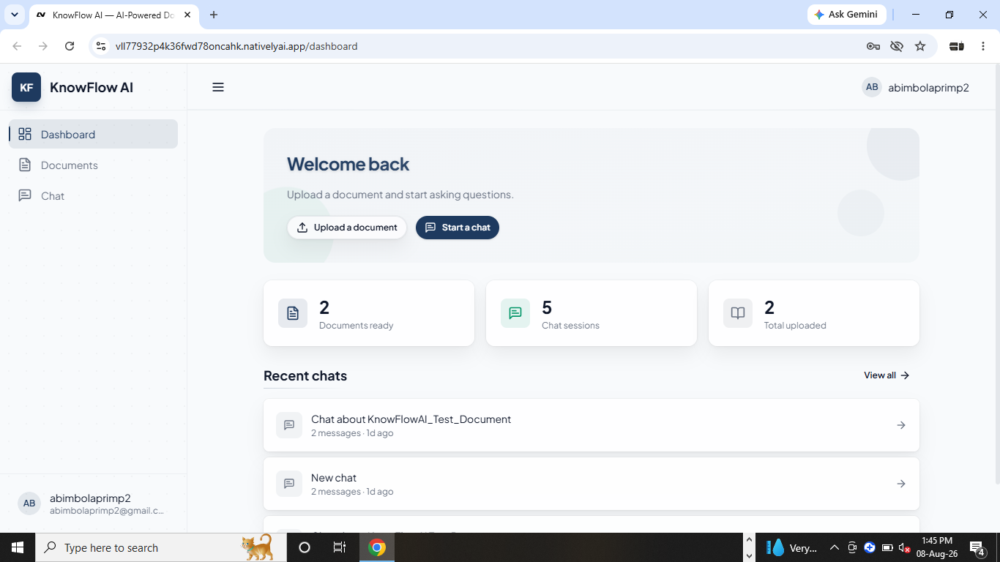
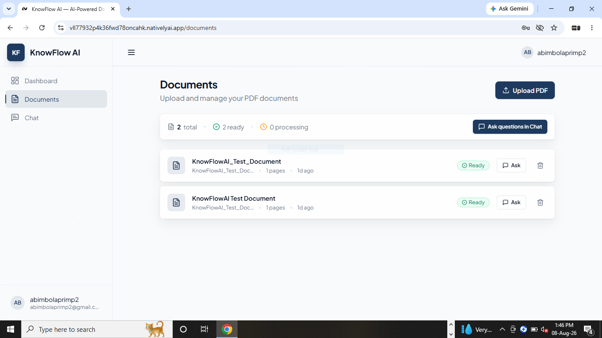
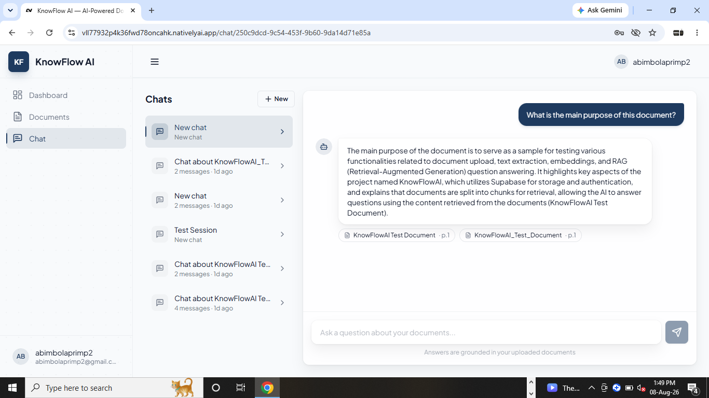
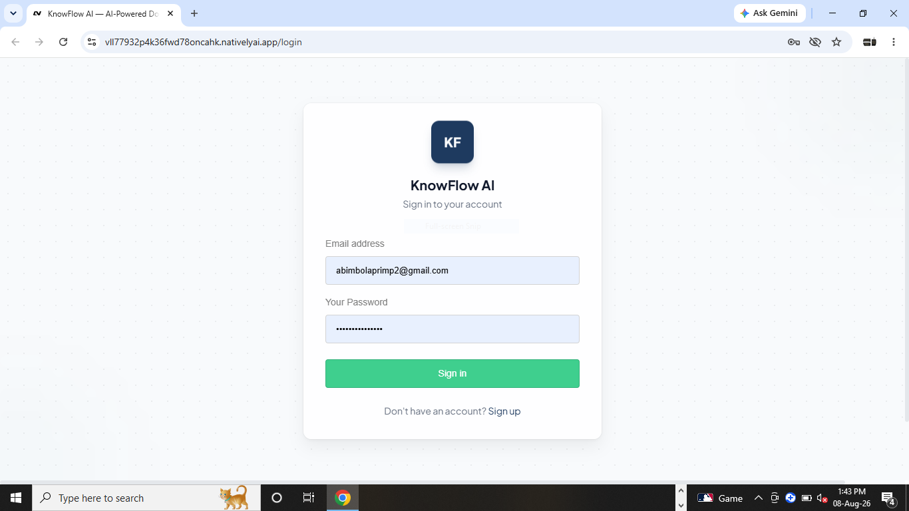

# KnowFlow AI 🤖📄

**Your AI workplace assistant for instant company knowledge.**

KnowFlow AI lets teams upload documents (PDFs, text files) and ask natural-language questions about them. Every answer is grounded in your own documents — with source citations so you always know where the information came from.

Built for the hackathon demo: a polished, production-style React frontend backed by a fully serverless RAG pipeline on Supabase.

---

## ✨ Features

- **🔐 Secure Authentication** — Email/password sign-up & login via Supabase Auth, with protected routes and per-user data isolation (Row-Level Security).
- **📁 Document Management** — Upload PDFs/text files (drag & drop), track processing status (`Processing` → `Ready` / `Error`), and delete documents you own.
- **🧠 RAG-Powered Chat** — Ask questions in natural language. Your documents are chunked, embedded, and semantically searched to retrieve the most relevant passages.
- **📚 Cited Answers** — Every AI response includes citations pointing to the source document and excerpt, so answers are verifiable.
- **💬 Persistent Chat History** — Conversations are saved automatically; resume any session from the sidebar.
- **📊 Dashboard** — Quick stats (document count, recent activity) and fast actions to upload or start chatting.
- **📱 Responsive UI** — Clean, professional design that works from mobile to desktop.

---
## Screenshots

### Dashboard


### Document Upload


### Chat with Citations


### Login / Sign Up


---

## Demo

[Live demo](https://vll77932p4k36fwd78oncahk.nativelyai.app/)


---

## Team

Built for AI Factory Hackathon by Lablab.ai:

| Name | Role |
|------|------|
| BimbsyStats | Team Lead RAG & Backend Lead + Final Presentation/Demo Video|
| Kaleem | Research, Testing & Error Fixing|
| Ahmed | Frontend/UI Developer /Technical & Repository Lead |
| Momina | Presentation & UI Design |
| Hmza | No Role Assigned Yet |
---

## Known Limitations

- Only PDF and plain-text documents are currently supported (DOCX, Markdown, and spreadsheets are on the roadmap).
- Chat responses are returned in full rather than streamed token-by-token.
- Single AI provider (AIML API) - no fallback if the provider is down.
- No team/workspace sharing yet; documents and chats are strictly per-user.
- Large PDFs (100+ pages) may take longer to process since chunking and embedding run synchronously in the Edge Function.

---

## Acknowledgments

- Built for AI Factory Hackathon by Lablab.ai, August 6–10, 2026.
- Powered by AIML API (OpenAI-compatible embeddings + chat completions).
- Backend infrastructure by Supabase (Auth, Postgres, pgvector, Storage, Edge Functions).
- UI components adapted from shadcn/ui.


## 🏗️ Architecture

```
┌─────────────────────────────────────────────────────────────┐
│                     Frontend (React + Vite)                  │
│  • Auth (Supabase Auth)     • Dashboard                     │
│  • Documents (upload/list)  • Chat (RAG Q&A)                │
└───────────────┬──────────────────────────┬──────────────────┘
                │                          │
        Supabase Client             Supabase Edge Functions
        (JWT auth, RLS)            (server-side processing)
                │                          │
┌───────────────▼──────────────────────────▼──────────────────┐
│                        Supabase                              │
│  • Auth          • Postgres (RLS)   • Storage (documents/)   │
│  • Edge Functions: process-document, rag-chat                │
└───────────────────────────┬──────────────────────────────────┘
                            │
                   ┌────────▼────────┐
                   │   AIML API      │
                   │ (OpenAI-compat) │
                   │ • embeddings    │
                   │ • GPT-4o-mini   │
                   └─────────────────┘
```

### How a question is answered (RAG flow)

1. User uploads a PDF → stored in Supabase Storage.
2. `process-document` Edge Function extracts the text (via pdf.js), splits it into ~1000-char chunks, generates vector embeddings (`text-embedding-3-small`), and stores them in `document_chunks`.
3. User asks a question → `rag-chat` Edge Function embeds the query and runs a semantic search (`match_document_chunks` vector function) over **that user's documents only**.
4. The top relevant chunks are injected into the GPT-4o-mini system prompt along with conversation history.
5. The cited answer is streamed back and saved to `chat_messages`.

---

## 🧰 Tech Stack

| Layer | Technology |
|-------|------------|
| **Frontend** | React 18, TypeScript, Vite 7 |
| **Styling** | Tailwind CSS v4, shadcn/ui (Radix primitives), Lucide icons |
| **Routing** | React Router v7 |
| **Auth** | Supabase Auth (email/password) |
| **Database** | Supabase Postgres + pgvector |
| **Storage** | Supabase Storage (`documents` bucket) |
| **Backend** | Supabase Edge Functions (Deno) |
| **AI** | AIML API (OpenAI-compatible): `text-embedding-3-small` + `gpt-4o-mini` |
| **PDF parsing** | pdfjs-dist (runs inside the Edge Function) |

---

## 📁 Project Structure

```
├── public/                  # Static assets
├── src/
│   ├── components/
│   │   ├── auth/            # AuthGuard (protected routes)
│   │   ├── layout/          # AppLayout (sidebar + top bar)
│   │   └── ui/              # shadcn-style primitives (button, card, dialog…)
│   ├── lib/
│   │   ├── api.ts           # API layer — Supabase + Edge Function calls
│   │   ├── auth-context.tsx # Auth state provider
│   │   ├── supabase.ts      # Supabase client
│   │   └── utils.ts         # Helpers (cn, formatting)
│   ├── pages/
│   │   ├── login.tsx        # /login
│   │   ├── signup.tsx       # /signup
│   │   ├── dashboard.tsx    # /dashboard
│   │   ├── documents.tsx    # /documents
│   │   └── chat.tsx         # /chat, /chat/:sessionId
│   ├── App.tsx              # Routes
│   ├── main.tsx             # Entry point
│   └── index.css            # Tailwind v4 + design tokens
├── supabase/                # Edge Functions & migrations (in Supabase)
├── index.html
├── package.json
└── vite.config.ts
```

### Routes

| Route | Page |
|-------|------|
| `/login` | Login |
| `/signup` | Sign up |
| `/dashboard` | Dashboard — stats & quick actions |
| `/documents` | Upload & manage documents |
| `/chat` | Start a new chat |
| `/chat/:sessionId` | Resume an existing chat |

---

## 🗄️ Database Schema

All tables have **Row-Level Security** enabled — users can only see their own data.

### `documents`
| Column | Type | Notes |
|--------|------|-------|
| `id` | uuid (PK) | |
| `user_id` | uuid (FK → auth.users) | Owner |
| `title` | text | Display title |
| `file_name` | text | Original file name |
| `file_type` | text | MIME type |
| `file_size` | integer | Bytes |
| `storage_path` | text | Path in Storage bucket |
| `status` | text | `processing` / `ready` / `error` |
| `page_count` | integer | Chunk count |
| `created_at` / `updated_at` | timestamptz | |

### `document_chunks`
| Column | Type | Notes |
|--------|------|-------|
| `id` | uuid (PK) | |
| `document_id` | uuid (FK → documents) | |
| `chunk_index` | integer | Order within document |
| `content` | text | Chunk text |
| `embedding` | vector(1536) | pgvector embedding |
| `page_number` | integer | Source page |

### `chat_sessions`
| Column | Type | Notes |
|--------|------|-------|
| `id` | uuid (PK) | |
| `user_id` | uuid (FK → auth.users) | |
| `title` | text | Auto-generated session title |
| `created_at` / `updated_at` | timestamptz | |

### `chat_messages`
| Column | Type | Notes |
|--------|------|-------|
| `id` | uuid (PK) | |
| `session_id` | uuid (FK → chat_sessions) | |
| `role` | text | `user` / `assistant` |
| `content` | text | Message body |
| `citations` | jsonb | Source document references |
| `created_at` | timestamptz | |

---

## ⚡ Edge Functions

### `process-document`
Handles the upload pipeline:
1. Downloads the file from Supabase Storage.
2. Extracts text (pdf.js for PDFs, plain text otherwise).
3. Splits text into overlapping chunks (~1000 chars).
4. Generates embeddings via AIML API.
5. Inserts chunks into `document_chunks` and marks the document `ready`.

### `rag-chat`
Handles the Q&A pipeline:
1. Verifies the session belongs to the caller (JWT).
2. Saves the user message.
3. Embeds the query and calls `match_document_chunks` (vector search, threshold 0.1, top 5, scoped to the user).
4. Builds a grounded system prompt from the retrieved excerpts.
5. Calls GPT-4o-mini with conversation history and returns the cited answer.
6. Persists the assistant message with citations.

---

## 🚀 Getting Started

### Prerequisites
- Node.js 20+
- npm
- A Supabase project with:
  - Email/password auth enabled
  - The `documents` Storage bucket
  - The `pgvector` extension
  - The 4 tables above + the `match_document_chunks` function
  - Deployed `process-document` and `rag-chat` Edge Functions
- An **AIML API** key (stored as a Supabase Edge Function secret — never in client code)

### Installation

```bash
# 1. Clone the repository
git clone https://github.com/<your-org>/knowflow-ai.git
cd knowflow-ai

# 2. Install dependencies
npm install

# 3. Start the dev server
npm run dev
```

### Configuration

The Supabase client reads publishable credentials from `src/lib/supabase.ts`. In production these come from your Supabase project URL and anon/publishable key.

**Secrets (Supabase Edge Function secrets — never in `.env` or client code):**

| Secret | Used by | Purpose |
|--------|---------|---------|
| `AIMLAPI_API_KEY` | both functions | AI embeddings + chat completions |
| `SUPABASE_SERVICE_ROLE_KEY` | both functions | Server-side DB/storage access |

### Scripts

```bash
npm run dev       # Start Vite dev server
npm run build     # Type-safe production build (Vite)
npm run preview   # Preview the production build
```

---

## 🔒 Security

- **Row-Level Security** on every table — users only access their own documents, sessions, and messages.
- **JWT verification** in Edge Functions — requests are authorized with the caller's Supabase session token.
- **Secrets never leave the server** — the AIML API key lives only in Supabase Edge Function secrets, never in client code or environment files.

---

## 🧪 Demo Flow

1. **Sign up** with an email & password.
2. Go to **Documents** and upload a PDF (wait for it to reach `Ready`).
3. Go to **Chat**, ask anything about the document — e.g. *"What is this document about?"* or *"Summarize the key points."*
4. Check out the **citations** under each answer, and revisit the conversation any time from the sidebar.

---

## 🤝 Contributing

1. Fork the repository.
2. Create a feature branch (`git checkout -b feature/amazing-feature`).
3. Commit your changes (`git commit -m 'Add some amazing feature'`).
4. Push to the branch (`git push origin feature/amazing-feature`).
5. Open a Pull Request.

---

## 🛠️ Roadmap

- [ ] Streaming chat responses (token-by-token)
- [ ] Support for more file types (DOCX, Markdown, spreadsheets)
- [ ] Document summaries & key-fact extraction
- [ ] Admin dashboard & team workspaces
- [ ] Webhook-based processing status updates

---

## 📄 License

This project was built for a hackathon and is provided as-is. Reach out to the maintainers for licensing questions.

---

*Built with ❤️ by the KnowFlow AI team — React, Vite, Supabase, and a whole lot of RAG.*
